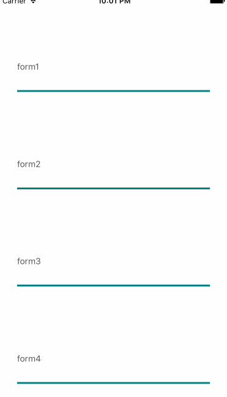
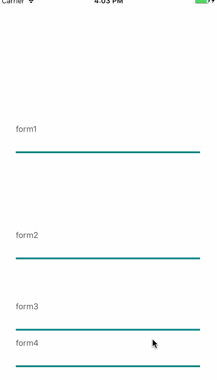
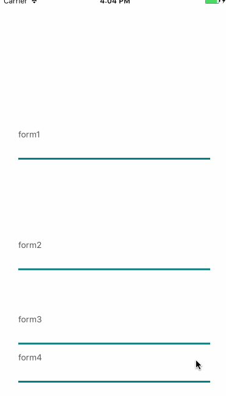

# react-native-flex-keyboard-spacer
This is keyboard-spacer for flex view.
If you are anguished at hiding keyboard TextInput, this package makes you calm.


## install

```sh
npm install react-native-flex-keyboard-spacer
```

## demo


## howToUse

See also [demo codes](./demo).

```js
class TextField extends Component {
    render() {
        const { style, label, spacerProps } = this.props;
        return (
            <View style={[styles.container, style]}>
                <Text style={styles.label}>{label}</Text>
                <TextInput {...spacerProps(this)} style={styles.textInput} />
            </View>
        );
    }
}

const App = (props) => {
    const { spacerProps } = props;
    return (
        <View style={styles.container}>
            <TextField spacerProps={spacerProps[0]} label="form1" style={{ flex: 4 }} />
            <TextField spacerProps={spacerProps[1]} label="form2" style={{ flex: 3 }} />
            <TextField spacerProps={spacerProps[2]} label="form3" style={{ flex: 2 }} />
            <TextField spacerProps={spacerProps[3]} label="form4" style={{ flex: 1 }} />
        </View>
    );
};

export default keyBoardSpacer({
    numbers: 4,
})(App);

```
## API

### keyboardSpacer
| properties | default | description |
|:--- | :--- |:--- |
| number | 0 |how many generate spacerProps |
| unTrack | false | if true, unTrackMode|

#### unTrackMode
|false| true|
|:--- |:--- |
|||


### spacerProps

```
<TextInput {...spacerProps(this)} style={styles.textInput} />
// spacerProps(this[, option])
```

#### option
|properties|type|description|
|:---- |:----  |:----|
|height|number|extraHeight|
