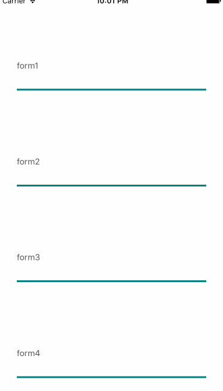

# react-native-flex-keyboard-spacer
This is keyboard-spacer for flex view.
If you are anguished at hiding keyboard TextInput, this package makes you calm.
In the future this package will be applied to scrollview.

## install

```sh
npm install react-native-flex-keyboard-spacer
```

## demo


## howToUse

```js
class TextField extends Component {
  render() {
    const {fields} = this.props;
    _fields = fields(this);
    return (
      <View style={styles.textInputContainer}>
        <Text style={styles.label}>{this.props.label}</Text>
        <TextInput
          {..._fields}
          style={styles.textInput}
        />
      </View>
    );
  }
}

const TextFieldContainer = (prop) => (
  <View style={styles.formContainer}>
    <TextField label={prop.label} fields={prop.fields} / >
  </View>
);

const App = (prop) => {
  const { fields } = prop;
  return (
    <View style={styles.container}>
        <TextFieldContainer fields={fields[0]} label="form1" />
        <TextFieldContainer  fields={fields[1]} label="form2" />
        <TextFieldContainer  fields={fields[2]} label="form3" />
        <TextFieldContainer  fields={fields[3]} label="form4" />
    </View>
  );
}

export default KeyBoardSpacer({
  numbers: 4,
})(App);
```
